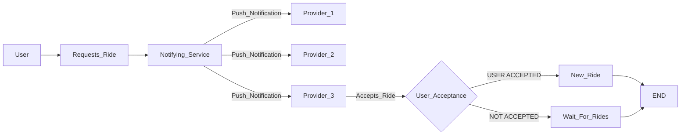

 ## NOVA RIDE BACKEND 

Nova rides is a Nova Scotia based application that intends to help rural community with low access to global ride sharing applications 
with the help of community persons.

#### BASE ASSUMPTION : 

1. User - within the local community or requests in a community
2. Provider - (While signup - provided where primarily served, Provider cannot serve more than 3 locations )

